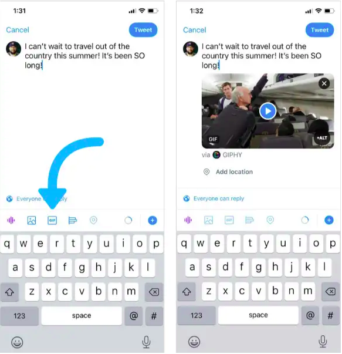

# Twitter Overview

## Step #1: Set Up A Profile

The first step to using Twitter as a beginner is to set up a profile. That way, people will know what your page is about and the sort of content they can expect from you.

*You’ll need:*

**A nickname.** Your Twitter handle is what appears after the @ symbol and must be unique to your Twitter account. Character count: 15 max.

**A name.** Your Twitter name is an interchangeable identifier that will be found above your nickname in every Tweet. Your name can be the exact same as your handle, a brand hashtag, a slogan, etc. It’s your call! Character count: 4 min - 50 max.

**A profile picture.** Recommended dimensions for profile images are 400x400 pixels.

**A cover photo.** Recommended dimensions for cover photos are 1500x500 pixels.

**A short bio.** A short but sweet description of what your Twitter page is about. Character count: 160 max.

**A link to your website.**

Your nickname, profile picture, and cover photo are all representations of your brand, so it’s important for them to be high res and accurately reflect what your page is about.

Similarly, your bio will be your first opportunity to tell your brand’s story, so use it to your advantage.

## Step #2: Learn the Terms

Retweets, Quote Tweets, Mentions...these are all terms you’ll need to familiarize yourself with to set yourself up for success on the platform.

Understanding specific Twitter features and how Twitter users speak will help you better engage and create content for the platform.

Here are a few top-level terms to learn:

**Hashtag:** Any word/phrase immediately preceded by the # symbol (i.e., #PennState). When you click on a hashtag, you'll see all Tweets containing that same keyword.

**Mention:** Mentioning other accounts in your Tweet by including their nickname is called a “mention”. You’ll also be able to see all Tweets that mention yours in your Notifications section.

**Retweet:** This is a way to share Tweets from other accounts to your followers. You can Retweet other accounts to pass along news, resources, or other valuable content. You can also Retweet your own Tweets to resurface an older Tweet.

**Quote Tweet:** If you want to Retweet something, but also add commentary, Quote Tweeting is your go-to. 

**Thread:** A series of connected Tweets from one account allowing you to provide additional information or updates to existing Tweets.

**Like:** An alternative to Retweeting a Tweet is Liking it. Likes are a great way to show appreciation to followers. You can view all Tweets that you’ve liked by clicking the Likes tab on your profile page.

## Step #3: Use Twitter’s Different Content Formats

While Twitter was originally used as a way to share text-only messages, you can now include visuals to elevate your Tweets.

In fact, Tweets with GIFs receive 55% more engagement than those without.

When crafting a Tweet, you have the option to add a photo, video, or GIF:

You can even add Polls to your Tweets, which can be a fun way to bolster engagement from your followers.

More recently, Twitter began testing a Voice Tweets feature, enabling users to publish audio messages.

This allows creators and public figures to further showcase their personality and establish a human connection with their audience.

And with the Clubhouse-inspired feature, Twitter Spaces, you can host podcast-like conversations with followers and like-minded people within your niche.

## Step #4: Create a Content Strategy

Now that you understand the Twitter basics, what’s next?

Setting goals and developing a content strategy. Before you begin creating and posting Tweets, you need to think about what you’re using Twitter for.

Some goals might include:

Increasing website traffic by 10% MOM

Growing your followers by 15% MOM

Increasing engagement by 25% YOY and developing an engaged community

Inserting your brand into 5 relevant, topical conversations per month

Depending on your niche, developing content pillars will help you determine the type of content you’ll create on Twitter.

- [Home](./README.md)
- [Twitter Overview](./twitter-overview.md)
- [Instagram Overview](./instagram-overview.md)
  - [How to take photos for Instagram](./take-pics-for-insta.md)
  - [How to write captions for Instagram](./write-captions-for-insta.md)
  - [How the Instagram algorithm works](./algorithm-insta.md)